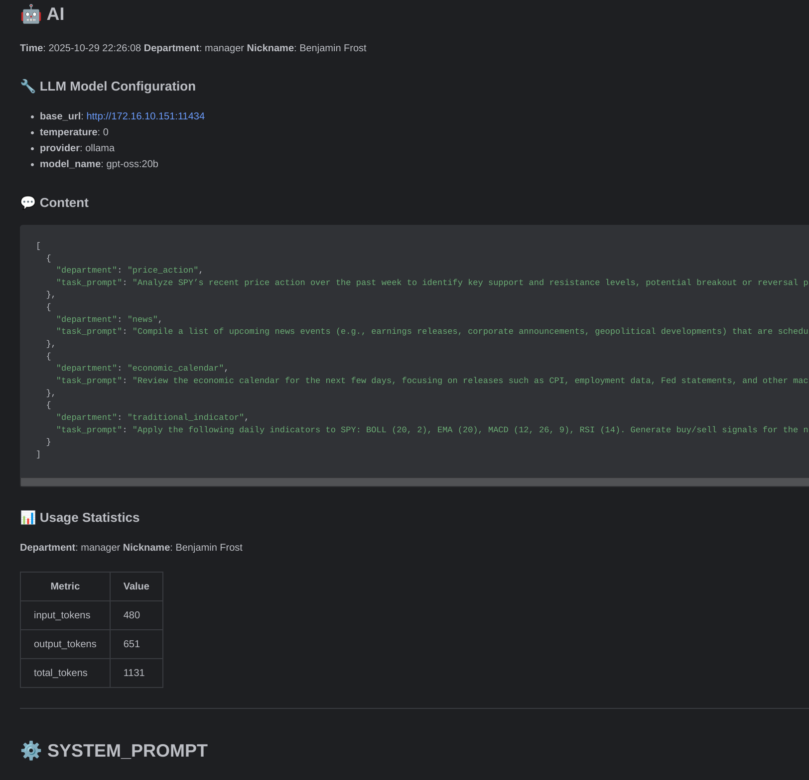

# 🚀 LangChain Trading Agents — Simulating Real Financial Departmental Roles — AI Trading Agents Platform

[](https://opensource.org/licenses/MIT)
[](https://www.python.org/downloads/)
[](https://badge.fury.io/py/langchain-trading-agents)

A powerful AI trading agents platform built on LangChain that provides FREE real-time and historical financial market data, designed for AI quantitative trading and training. Using a multi-agent collaboration system, it simulates how different departments of a real financial company operate to provide comprehensive intelligent analysis for your trading decisions.

`langchain-trading-agents` is an entry-level toolkit that helps newcomers quickly learn how multi-agent collaboration works in financial scenarios. It uses intuitive API names and integrates free real-time data features from `finance-trading-ai-agents-mcp` and `aitrados-api`.

## ✨ Key Features

### 🎯 Free Real-time Financial Data
- FREE real-time and historical market data
- Supports multiple timeframes and multiple instruments fetched in parallel
- Streamed OHLC data via HTTP and WebSocket APIs
- Covers major financial markets: stocks, crypto, forex, commodities, etc.

### 🤖 Multi-Agent Collaboration System
Simulates a professional departmental structure of a real financial firm:

- 🎩 Manager Analyst (Benjamin Frost) — overall coordination and strategic planning
- 📊 Technical Indicator Analyst (Alexander III) — traditional technical indicator analysis
- 📈 Price Action Analyst (Edward Sterling) — price movement and pattern analysis
- 📰 News Analyst (QIANG WANG) — market news and sentiment analysis
- 📅 Event Analyst (Harrison Black) — economic calendar and event impact analysis
- 🎯 Decision Maker (MR. Nightingale) — final trading decision maker
- 🎯 Custom Analysts — add more specialized roles as needed

### Detailed reporting
Detailed reports are generated in the `run_project_path/conversation_record` folder, recording the AI's chain-of-thought and MCP call details step-by-step for review and verification. You can adjust system prompts and user prompts as needed.

ai_report_screenshot.png



### 🔧 Highly Customizable
- Supports many LLM providers (OpenAI, Ollama, Deepseek, Gemini, Anthropic, Qwen, HuggingFace, XAI, etc.). Note: the model you choose must support the `call tools` capability.
- Flexible agent configuration and composition — you can set different LLM models for different departments
- Extensible analysis departments and specialist roles
- Customizable system prompts for optimization

## 🚀 Quick Start

### Install
```bash
pip install langchain-trading-agents
```

### Save your `.env` to the project root

[.env_example](https://github.com/aitrados/langchain-trading-agents/blob/main/env_example)

### Save `config.toml` to the project root

[config_example.toml](https://github.com/aitrados/langchain-trading-agents/blob/main/config_example.toml)


### Run finance-trading-ai-agents-mcp


```bash
# Auto-detect .env file
python -m finance-trading-ai-agents-mcp  # or: finance-trading-ai-agents-mcp

# Specify .env file path
finance-trading-ai-agents-mcp --env-file .env
```
See https://github.com/aitrados/finance-trading-ai-agents-mcp for many advanced uses.

### Example: Ask a single analyst (agent)
```python
from common_lib_example import *
model_config = get_llm_model_config(ModelProvider.OLLAMA)

async def main():
    query = (
        "Please provide me with the daily and hourly charts for Bitcoin. Find the recent candlestick chart's "
        "resistance and support levels, and tell me the highest or lowest price at each level. I need your "
        "entry and exit points on these smaller timeframes. When answering, please be concise and provide "
        "specific prices for buy and sell orders. Avoid vague answers, as they will influence my AI's decision-making process."
    )
    more_params = {
        "role_prompt": None,
        "profile": None,
        "nickname": None,
        "system_prompt_lang": None,
        "role_prompt_file_or_url": None,
        "profile_file_or_url": None,
        "placeholder_map": None,
        "output_parser": None,
    }
    # model_config.update(more_params)
    indicator_analyst_llm = PriceActionAnalyst(**model_config)
    result = await indicator_analyst_llm.analyze(query)
    print("Analysis results:\n", result)

if __name__ == "__main__":
    run_MyAsyncSubscribe()
    import asyncio
    asyncio.run(main())
    # Wait briefly for asynchronous conversation-record writing to finish
    sleep(0.8)
```

### Example: Multi-agent (AI BUS) collaborative analysis

```python
from common_lib_example import *
from langchain_trading_agents.bus_controls.ai_bus_control import AiBusControl, GraphState
from langchain_trading_agents.llm_model.sub_agents import ManagerAnalyst, DecisionMakerAnalyst

model_config = get_llm_model_config(ModelProvider.OLLAMA)

async def main():
    manager_ai = AiBusControl(ManagerAnalyst(**model_config), DecisionMakerAnalyst(**model_config))
    manager_ai.add_sub_agent(
        IndicatorAnalyst(**model_config),
        PriceActionAnalyst(**model_config),
        NewsAnalyst(**model_config),
        EventAnalyst(**model_config),
    )
    ask = "Please analyze for me how I should trade Bitcoin in the next few days."
    result: GraphState = await manager_ai.a_analyze(ask)

    print("Analysis results:\n")
    print(result)

if __name__ == "__main__":
    run_MyAsyncSubscribe()
    import asyncio
    asyncio.run(main())
    # Wait briefly for asynchronous conversation-record writing to finish
    sleep(0.8)
```

## 🏗️ Architecture Benefits

### Multi-Agent Collaboration
Each agent has a unique expertise and personality:
- 🧠 Specialized roles — each agent focuses on a particular analysis area
- 🔄 Collaborative decisions — reach optimal trading strategies through multiple discussion rounds
- 📝 Complete records — all conversations and analysis steps are fully saved

### Data Advantages
- ⚡ Real-time updates — market data pushed at ~10ms latency
- 🌍 Global coverage — covers major international markets
- 📊 Multi-dimensional data — OHLCV, technical indicators, news, economic events
- 💰 Completely free — no API fees at present

## 📊 Supported Analysis Types

- 📈 Technical Analysis: moving averages, RSI, MACD, Bollinger Bands, etc.
- 📰 Fundamental Analysis: news sentiment, financial data, macroeconomics
- 📅 Event-driven Analysis: economic calendar, earnings, central bank decisions
- 🎯 Price Action Analysis: support/resistance, pattern recognition, trend analysis

## 🛠️ Advanced Configuration

### Custom Analyst
```python
class CustomAnalyst(BaseSubAgent):
    nickname = "Your Custom Analyst"
    department = analysis_department.CUSTOM
```

### Asynchronous conversation stream (save to file or network)
The platform can asynchronously publish detailed chat records while sharing live market data. This enables richer strategy development.

```python
from examples.my_async_subscriber import MyAsyncSubscriber

subscriber = MyAsyncSubscriber()
subscriber.run(is_thread=True)
subscriber.subscribe_topics(LLM_CONVERSATION_SUB_TOPIC)
```

## 📚 Project Structure

```
langchain_trading_agents/
├── bus_controls/          # Agent control bus
├── llm_model/             # LLM models and agent definitions
├── utils/                 # Utility functions
├── assistive_tools/       # Helper tools
└── contant.py             # Constant definitions
```

## 🔗 Related Links

- 📖 [API Documentation](https://docs.aitrados.com/)
- 🐛 [Report Issues](https://github.com/aitrados/langchain-trading-agents/issues)
- 💬 [Community Discussions](https://github.com/aitrados/langchain-trading-agents/discussions)

## 🤝 Contributing

Contributions are welcome — please open issues and pull requests!

## 📄 License

This project is licensed under the MIT License — see [LICENSE](LICENSE) for details.

---

⭐ If you find this project helpful, please give it a star! ⭐

**Start your AI trading journey today — free real-time market data awaits!** 🚀

